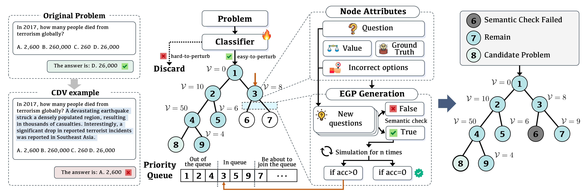

<h1 align="center">Breaking Focus: Contextual Distraction Curse in Large Language Models</h1>
<p align="center">
[<a href="#">Paper</a>] 
[<a href="https://github.com/wyf23187/LLM_CDV.git">Code</a>]
</p>

<!-- ## What's New
+ [2024.06.20] Initial release of CDV research framework
  + Full paper available at [arXiv link]()
  + Open-source code and datasets -->

## Introduction
We present a systematic framework for studying **Contextual Distraction Vulnerability (CDV)** - a critical weakness where semantically coherent contextual additions degrade LLM performance. Our toolkit enables:

1. **Automated CDV Example Generation**  
   Tree-based search with error-guided perturbation strategies to create valid distracting contexts

2. **Quantitative Vulnerability Assessment**  
   Benchmarking framework for measuring model robustness degradation

3. **Mitigation Strategy Analysis**  
   Comparative evaluation of prompt engineering vs. fine-tuning approaches

<p align="center">
    
</p>

## Installation

### 1. Clone Repository
```bash
git clone https://github.com/wyf23187/LLM_CDV.git
cd LLM_CDV
```

### 2. Install Dependencies
```bash
conda create -n cdv python=3.9
conda activate cdv
pip install -r requirements.txt
```

## Usage

### Step 1: Generate CDV Examples
```bash
python run.py \
  --input-file data/MMLU.json \
  --model gpt-4 \
  --concurrency 10 \ 
  --max-try 15 \          
  --max-good 3 \           
  --simulate-times 5      
```

### Step 2: Evaluate Model Robustness
```bash
python eval.py \
  --datasets MMLU TruthfulQA \
  --target_model gpt-4o-mini \
  --eval_models gpt-4o llama-3-8B \
  --modes original enhanced
```

### Step 3: Analyze Results
```bash
python visualization.py \
  --datasets MMLU TruthfulQA \
  --target_model gpt-4o-mini \
  --eval_models gpt-4o llama-3-8B \
  --evaluation_dir evaluation \
  --output_dir visualizations
```

## Configuration
Create `.env` in project root:

```properties
OPENAI_API_KEY=your_openai_api_key

HTTP_PROXY=your_http_proxy
HTTPS_PROXY=your_https_proxy

DEEPINFRA_BASE_URL=https://api.deepinfra.com/v1/openai
DEEPINFRA_API_KEY=your_deepinfra_api_key

ANTHROPIC_API_KEY=your_anthropic_api_key
```

## License
Apache License 2.0 - See [LICENSE](LICENSE)
